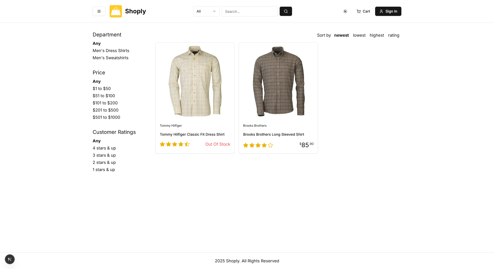
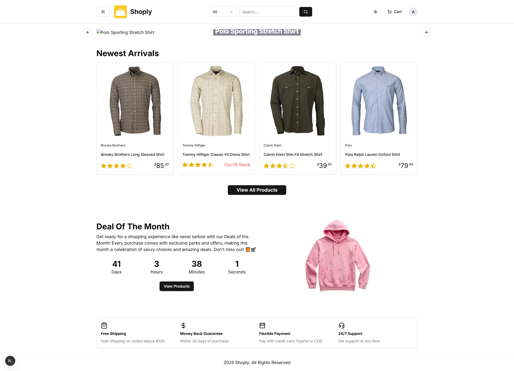
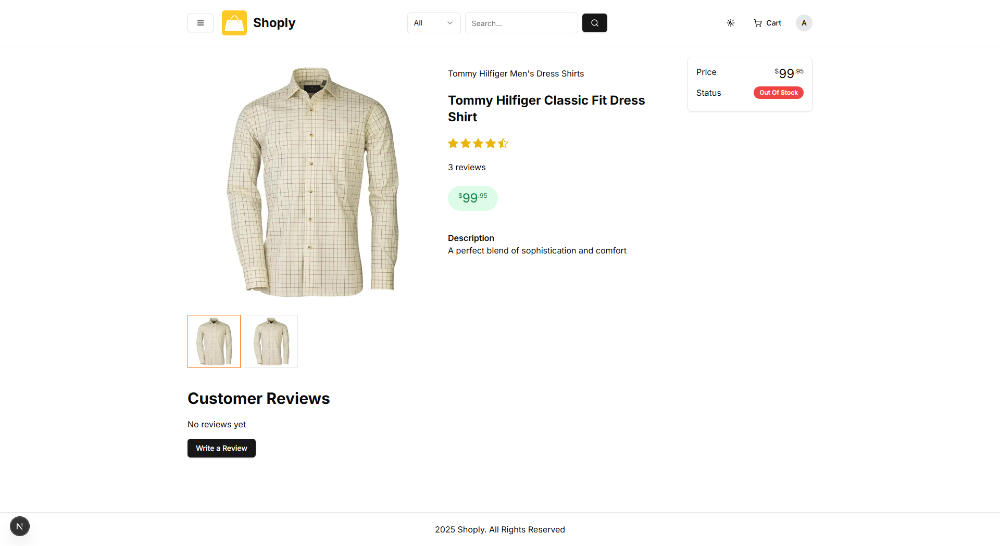

# 🚀 Shoply

> Ecommerce website built with next.js and postgres.

[](LICENSE)
[]()

---

## 📸 Demo / Screenshots

<p align="center">
  
  
  
</p>

---

## 📜 About

Full Ecommerce site with payment integration

---

## ✨ Features

- ✅ Log in log out user
- ✅ Add to cart
- ✅ Order history
- ✅ Admin Dashboard
- ✅ Payment Integration (Stripe and Paypal)
- ✅ Email Invoice PDF

---

## 🛠 Tech Stack

**Frontend:** Next.js, TailwindCSS, ShadCN, typescript
**Backend:** Next.js, prisma, neon, jest, typescript, uploadthing, react-email, Zod
**Database:** Postgres

---

## ⚙️ Installation

### You will have to register with some third party software companies

- **_Emails:_** Resend
- **_Payments:_** Paypal, Stripe
- **_Database:_** Neon (you do not have to but its what i used)
- **_Images:_** Uploadthing

```bash
# Create a .env file
NEXT_PUBLIC_APP_NAME = 'Shoply'
NEXT_PUBLIC_APP_DESCRIPTION = "Modern e-commerce for developers"
NEXT_PUBLIC_SERVER_URL  = 'http://localhost:3000'

NEXTAUTH_SECRET = ''
NEXTAUTH_URL_INTERNAL='http://localhost:3000'
NEXTAUTH_URL='http://localhost:3000'

DATABASE_URL=""
ENCRYPTION_KEY = ''

PAYMENT_METHODS= "PayPal, Stripe, CashOnDelivery"
DEFAULT_PAYMENT_METHOD= "PayPal"

PAYPAL_API_URL = 'https://api-m.sandbox.paypal.com'
PAYPAL_CLIENT_ID = ''
PAYPAL_APP_SECRET = ''

UPLOADTHING_TOKEN=''
UPLOADTHING_SECRET=''
UPLOADTHING_APPID=''

RESEND_API_KEY=''
SENDER_EMAIL= ''

STRIPE_SECRET_KEY = ''
NEXT_PUBLIC_STRIPE_PUBLISHABLE_KEY = ''
STRIPE_WEBHOOK_SECRET = ''

# Clone the repo
git clone https://github.com/Daneelv/ticket-logger.git

# Install dependencies
npm install

# Run locally
npm run dev
```
